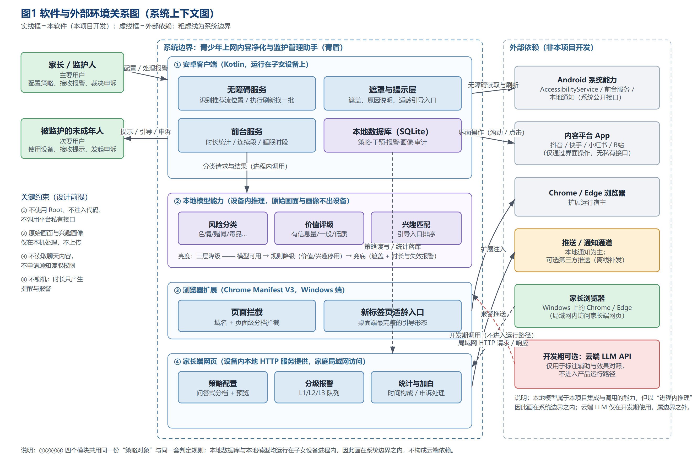
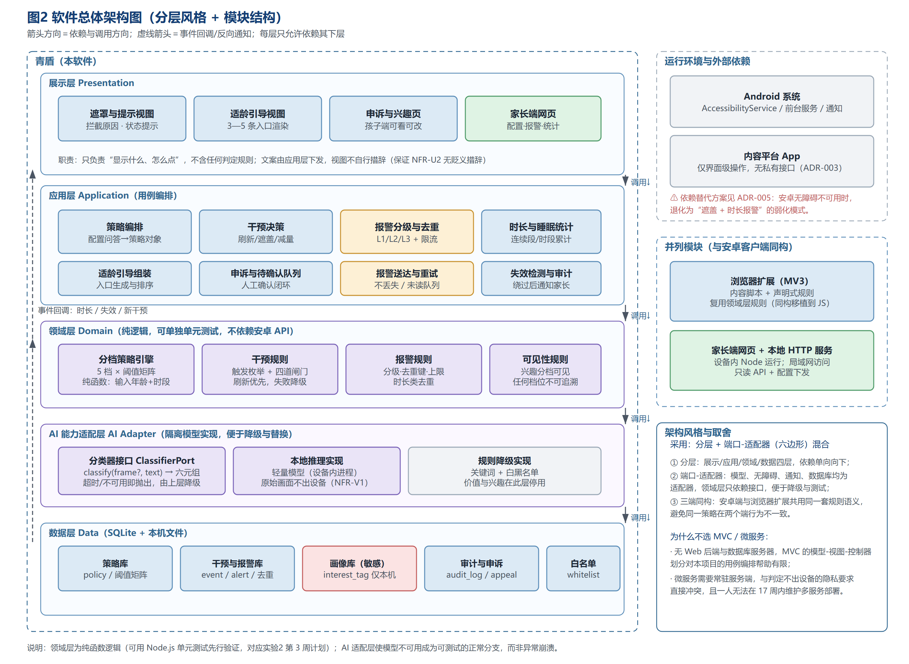
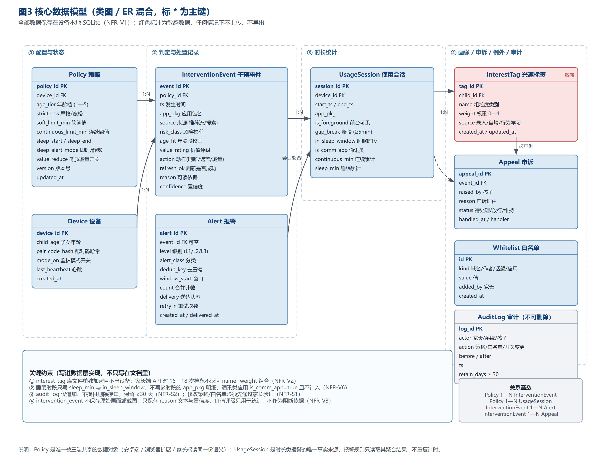
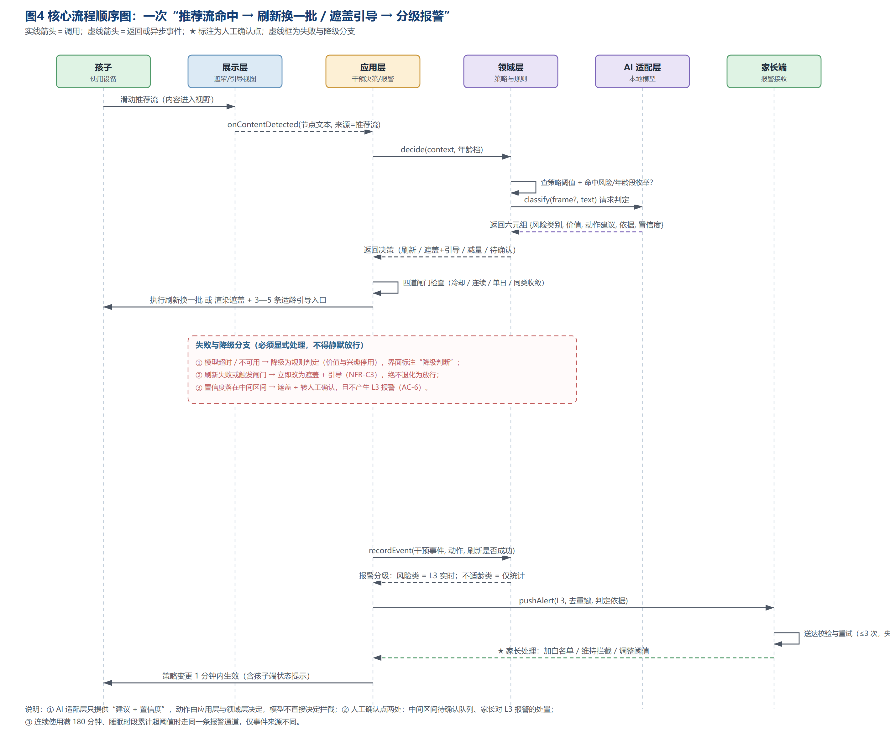
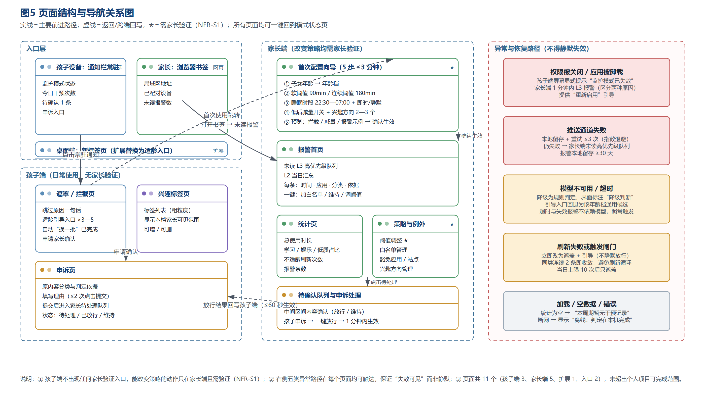
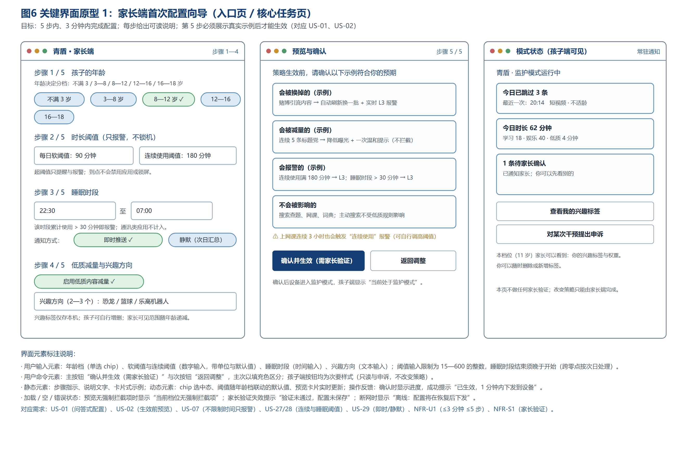
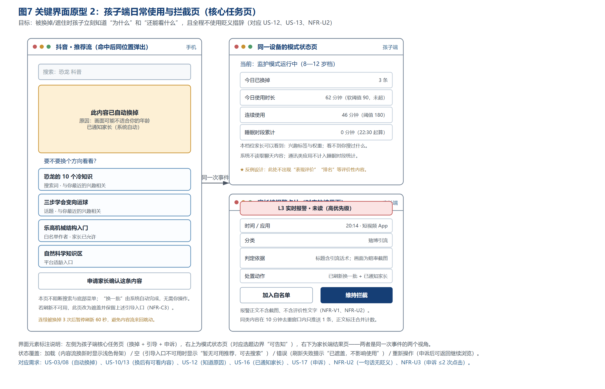
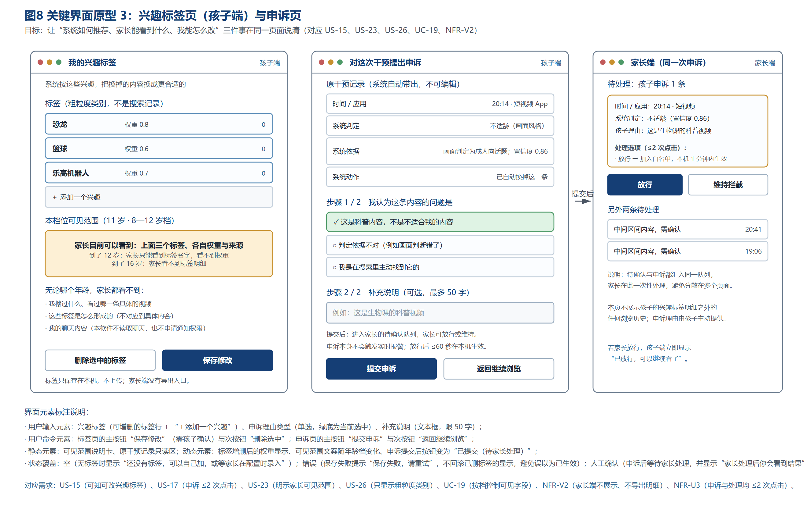

# 实验3：软件架构与界面设计

## 学习通提交说明

- **提交平台：** 只向学习通对应的“实验报告”作业上传一份PDF文件。
- **班级：** 软工2班。
- **姓名：** 蔡春阳。
- **学号：** 24111302097。
- **项目名称：** 青少年上网内容净化与监护管理助手（工作名：青盾）。
- **文件命名：** 班级-学号-姓名-实验3-软件架构与界面设计.pdf。
- **PDF内容：** 需求与设计对应表、技术选型与架构决策、软件与外部环境关系图、总体架构图与模块说明、数据与接口设计、核心流程图、关键界面原型、设计检查记录及仓库版本证据。
- **截止时间：** 以学习通作业设置为准。
- **设计输入：** 本文档以实验2 的《个人软件选题与需求分析》**V3.3** 为唯一需求基线（`实验2-个人软件选题与需求分析.md`，Commit `5b01fe5`），下文所有需求编号（US-xx / UC-xx / NFR-xxx / AC-x）均沿用该文档，不重新编号。

## 1. 实验目的

- 把实验2的需求说明转化为可指导后续开发的软件架构、模块边界、数据模型、接口和交互方案。
- 形成与个人能力匹配的技术选型，并保留关键决策依据。
- 完成关键设计，检查需求、架构与界面之间是否一致，为实验4的软件基础功能开发提供设计基线。

## 2. 实验内容

### 2.1 需求输入与设计范围

- 从实验2中选定一条核心用户流程，列出该流程对应的用户故事、功能需求、非功能需求和验收条件，作为本次设计的输入。
- 运用软件工程课程中学习的双向追踪原则，先建立“需求编号—准备完成的设计内容—对应图或文档”对应表，确保每项核心需求都有后续设计任务，后续也能从设计内容追溯到需求来源。
- 初步划分普通软件功能与AI功能的边界，说明哪些任务可以由确定的程序逻辑完成，哪些任务准备交给LLM处理，以及哪些结果需要程序校验或用户确认。本阶段不要求确定RAG、Agent等具体实现方法。

#### 2.1.1 本次设计选定的核心用户流程

按实验2 §2.6.1，本学期只重点完成**一条**核心用户流程，本次设计全部围绕它展开：

> **家长一次配置（年龄档 + 软阈值 + 连续使用阈值 + 睡眠时段 + 兴趣方向）→ 安卓端在抖音推荐流中命中“不符合年龄段”或“不健康”内容时直接刷新换一批（不健康内容同时实时 L3 报警家长）→ 刷新失败或分类不确定时退回遮盖 + 贴合兴趣的适龄引导 → 使用超软阈值只报警不锁机 → 家长端查看分级报警与时间构成，并一键加白或调整阈值。**

该流程的输入清单如下（引用实验2 编号）：

| 类别 | 编号与内容 | 本次设计需要落到的产物 |
|---|---|---|
| 用户故事 | US-01 问答式配置；US-02 生效前预览；US-03 不符合年龄段直接换掉；US-07 不限制时间只报警；US-08 黄赌毒实时报警；US-10 换掉后有可看内容；US-12 孩子知道原因；US-16 孩子端“已通知家长”；US-19 家长一键加白；US-27 连续 3 小时报警；US-28 睡眠时段报警 | 界面原型（图6、图7、图8）、策略对象、报警模型 |
| 功能需求 | UC-01 策略生成与下发；UC-03 命中后刷新换一批；UC-04 分级报警推送；UC-05 适龄引导；UC-07 时长与超时报警；UC-14 失效检测与报警；UC-19 兴趣可见性分档；UC-20 连续使用检测；UC-21 睡眠时段检测 | 图2 模块划分、图3 数据模型、§2.4 接口设计 |
| 非功能需求 | NFR-P3 报警时延 ≤10 s；NFR-P4 刷新 ≤800 ms；NFR-R1 不得静默放行；NFR-R6 报警不丢失；NFR-R7/R9 分级与去重；NFR-S1 家长验证；NFR-V1/V2/V6 隐私与可见性；NFR-C3 平台改版降级 | 图2 各层职责、图3 约束、§2.4 失败分支 |
| 验收条件 | AC-1 超时只报警不锁机；AC-2 不健康内容刷新 + L3；AC-2b 不符合年龄段也刷新；AC-4 刷不掉时必有引导；AC-6 不确定转人工且不 L3；AC-7 失效报警；AC-9 兴趣分档可见；AC-10 连续与睡眠报警 | §2.6 一致性检查表的“验收条件”列 |

#### 2.1.2 需求—设计双向追踪表

这是题目要求的“需求编号—准备完成的设计内容—对应图或文档”对应表。本表在 §2.6 被扩充为“架构模块—数据或接口—界面—验收条件”四列，用于逐项检查，不另做重复表格。

| 需求编号 | 需求摘要 | 本次完成的设计内容 | 对应图 / 文档 |
|---|---|---|---|
| US-01 / UC-01 | 问答式配置并生成策略 | 分档策略引擎（纯函数）；策略对象 `Policy`；配置向导界面 | 图2 领域层、图3 Policy、图6 |
| US-02 | 生效前预览拦截/减量/报警 | 预览卡片由领域层按策略实时生成；含“上网课连续 3 小时会报警”的提前告知 | 图6 第 5 步 |
| US-03 / UC-03 | 不符合年龄段内容直接换掉 | 干预规则（触发枚举 + 四道闸门）；`ACTION_SCROLL_FORWARD` 三级回退 | 图2 领域层/AI 适配层、图4 消息 8、§2.4 接口 I-02 |
| US-07 / UC-07 | 不限制时间，超软阈值只报警 | 时长统计服务与 L2 日报汇总规则；无锁机路径 | 图3 UsageSession、图4、图7 状态页 |
| US-08 / UC-04 | 黄赌毒实时 L3 报警 | 报警分级与去重键；送达重试与未读队列 | 图2 应用层、图4 消息 19—22、§2.4 接口 I-03 |
| US-10 / UC-05 | 换掉后有适龄可看内容 | 适龄引导组装 + 兴趣排序；四种引导手段与降级 | 图2 应用层、图3 InterestTag、图7 引导区 |
| US-12 / US-16 | 孩子知道原因与“已通知家长” | 展示层文案由应用层下发（视图不自行措辞） | 图2 展示层、图7 |
| US-19 | 家长一键加白 | 白名单读写接口 + 1 分钟内下发机制 | 图3 Whitelist、§2.4 接口 I-05 |
| US-27 / UC-20 | 连续使用 180 分钟报警 | 连续段判定（5 分钟断段、跨应用合并、全部应用计入） | 图3 UsageSession、§2.4 接口 I-04 |
| US-28 / UC-21 | 睡眠时段累计 >30 分钟报警 | 睡眠时段累计与跨天归属；通讯类排除；即时/静默 | 图3 UsageSession、图7 状态页 |
| UC-14 | 权限失效检测与报警 | 失效检测适配器 + L3 报警；孩子端显式提示 | 图2 应用层、图5“异常与恢复路径” |
| UC-19 | 兴趣可见性按年龄分档 | 可见性规则（领域层）+ 家长端 API 字段级控制 | 图2 领域层、图3 约束②、§2.4 接口 I-06 |
| NFR-P3 / P4 | 报警 ≤10 s；刷新 ≤800 ms | 报警队列与刷新动作的时延约束写入接口契约 | §2.4 接口失败列、§2.5 界面反馈设计 |
| NFR-R1 / C3 | 不得静默放行；改版即降级 | AI 适配层的降级实现 + 三层降级结构 | 图2 AI 适配层、图4 失败分支 |
| NFR-R6 / R7 / R9 | 报警不丢失、分级去重 | `Alert` 表的去重键与重试字段；送达状态机 | 图3 Alert、§2.4 接口 I-03 |
| NFR-S1 / S2 | 家长验证与审计 | 审计表仅追加；配置类接口前置验证 | 图3 AuditLog、§2.4 接口 I-01/I-05 |
| NFR-V1 / V2 / V6 | 判决与画像不出设备 | 数据层加密与字段级可见性；睡眠时段只留时长 | 图1 边界约束、图3 关键约束①②④ |
| AC-6 | 不确定内容转人工且不 L3 | 待确认队列与“中间区间不升格 L3”规则 | 图4 失败分支③、图5 待确认队列页 |

#### 2.1.3 普通程序功能与 AI 功能的边界划分

题目要求“初步划分普通软件功能与AI功能的边界”。本项目的划分原则是**用最可靠的手段做每一件事**：能用确定逻辑判定的绝不用模型，模型只负责“需要理解内容语义”的部分，且模型输出永远只是**建议 + 置信度**，动作由程序决定。

| 任务 | 由谁完成 | 理由 | 谁检查结果 |
|---|---|---|---|
| 年龄档 → 阈值矩阵、睡眠时段判定、连续段断段（≥5 分钟） | **普通程序** | 全是确定规则与算术，无歧义；且属于 NFR-P6/P7 要求高精度的统计口径 | 单元测试（实验2 第 3 周计划的 20 条测试） |
| 刷新动作的执行与四道闸门（冷却/连续/单日/同类收敛） | **普通程序** | 计数与计时问题，不需要理解内容 | 程序自检 + AC-2b / NFR-R8 实测 |
| 报警分级、去重键、限流、重试、未读队列 | **普通程序** | 可靠性要求（NFR-R6）不能交给概率模型 | 程序自检 + AC-3 实测 |
| 兴趣标签的增删与可见字段控制 | **普通程序** | 是权限问题而非判断问题；出错后果是隐私事故 | API 字段级检查（AC-9） |
| 内容**是否不适龄 / 是否属于黄赌毒类** | **本地模型（LLM 类能力）** | 判据是多模态且上下文相关；黄赌毒类使用变体与黑话规避关键词，规则会被绕过 | **应用层校验**：输出必须落在固定枚举内、必须带置信度与可读依据；置信度落中间区间一律转人工 |
| 内容**价值评级**（有信息量/一般/偏娱乐/低质） | **本地模型** | 连人都没有统一标准，只能给概率 | 应用层校验，且**只允许用于曝光调节与统计**，程序上禁止其触发刷新/阻断/报警 |
| **兴趣匹配**（引导入口排序） | **本地模型** | 个性化排序无法用规则表达 | 应用层校验：只影响排序，不影响是否适龄，也不影响是否放行 |
| 报警文案、提示文案的措辞 | **普通程序（模板 + 领域层下发）** | NFR-U2 要求“一句中文、无贬义”，不能由模型自由生成（幻觉风险 + 措辞不可控） | 视图层不做措辞，只渲染应用层下发的文本 |
| 是否放行、是否报警的**最终决定** | **普通程序 + 人工** | 见 §2.3 职责划分表 | 家长（人工确认点） |

**结论：模型不直接产生任何“动作”，只产生“判定建议”。** 这一点在架构上用 AI 适配层（图2）强制实现：适配层只暴露 `classify()` 与 `rank()` 两个查询方法，不提供任何写入或执行能力。

### 2.2 技术选型与架构决策

- 结合已学习的程序设计语言和软件设计约束，从本人熟悉程度、实现成本、框架生态、AI接入、测试和运行环境等方面比较候选方案。比较可以使用简单表格，不要求罗列过多技术或原因。
- 对开发语言与框架、数据保存方式、软件体系结构风格等关键选择编写简短的设计决策说明。设计决策说明也称架构决策记录（ADR），只需写清要解决的问题、考虑过的方案、最终选择、理由和可能的不足。
- 为一项可能影响项目继续开发的关键依赖准备替代方案，例如模型服务、数据库或主要框架。

#### 2.2.1 候选方案比较

**（1）开发语言与框架**

| 候选 | 熟悉程度 | 实现成本 | 框架生态 | AI 接入 | 测试 | 运行环境 | 结论 |
|---|---|---|---|---|---|---|---|
| **Kotlin + Android SDK（无障碍服务）** | 实验1 未使用，需新学；但有完整文档 | 中高（需真机调试） | 官方生态成熟 | 可通过 ONNX/TFLite 在设备内推理 | JUnit + 真机 | 目标用户全是安卓机 | **选用（安卓客户端主形态）** |
| Java + Android SDK | 与 Kotlin 相近 | 中（代码更冗长） | 成熟 | 同左 | 同左 | 同左 | 放弃：Kotlin 空安全与协程对“刷新+统计”这类异步逻辑更省事 |
| Flutter / 跨平台 | 低 | 低（界面快） | 无法访问 `AccessibilityService` | 受限 | 一般 | 不可用 | 放弃：**无障碍服务是核心能力，跨平台框架拿不到** |
| Python + Kivy/BeeWare | 中 | 高（打包与权限受限） | 移动端生态弱 | 强 | 一般 | 不适用 | 放弃：移动端部署与权限管理不可控 |

**（2）数据保存方式**

| 候选 | 成本 | 隐私（NFR-V1） | 适用性 | 结论 |
|---|---|---|---|---|
| **设备内 SQLite（Room 封装）** | 低 | 数据不出设备，天然满足 | 结构固定、需事务与聚合查询（时长统计） | **选用** |
| 文件（JSON/CSV） | 最低 | 满足 | 无事务、无聚合、并发写风险 | 放弃：时长统计需要按窗口聚合，文件方式会写得很痛苦 |
| 云端数据库（Firebase 等） | 中 | **不满足**（兴趣画像与干预明细上传） | 便于多端同步 | 放弃：与 NFR-V1/V2 直接冲突 |
| 设备内 SQLite + 云端备份（可选） | 中高 | 部分满足 | 可做 | 本学期不做：见实验2 §2.3.2 第 6 条 |

**（3）软件体系结构风格**

| 候选 | 适配度 | 理由 | 结论 |
|---|---|---|---|
| **分层 + 端口-适配器（六边形）** | 高 | 领域规则可脱离安卓 API 单测；“模型/无障碍/通知/数据库”都是可替换适配器，正好对应 NFR-C3 的降级要求 | **选用** |
| 纯分层 | 中 | 能分职责，但模型与安卓能力会渗进应用层，降级难做 | 部分采纳（分层作为骨架） |
| MVC | 低 | 本项目没有 Web 后端与数据库服务器，Controller 层意义有限 | 放弃 |
| 微服务 | 低 | 需常驻服务端，与“判定不出设备”冲突；一人无法维护多服务部署 | 放弃 |

#### 2.2.2 架构决策记录（ADR）

**ADR-001　客户端主形态：安卓应用（无障碍服务）而非其他形态**

- **要解决的问题**：用什么形态进入“推荐流”这个场景，才能既看到内容、又不越权。
- **考虑过的方案**：① 安卓无障碍服务应用；② 浏览器扩展（只能在浏览器内拦截）；③ 平台开放接口（抖音等无内容审核开放接口）；④ Root/Xposed 注入。
- **最终选择**：①，并把②作为桌面端的并列模块。
- **理由**：推荐流场景 90% 发生在 App 内（需求提出者的原话就是“刷到……直接刷新视频软件”），浏览器扩展覆盖不到；开放接口不存在；Root/注入违反实验2 §2.3.2 第 9 条（不引入特权手段）。
- **可能的不足**：依赖平台界面结构，平台改版即失效（已用 NFR-C3 的降级要求覆盖）；无障碍服务可能被系统或平台限制，因此第 5 周必须先做逐平台可行性实测（实验2 §2.6.2）。

**ADR-002　内容判定放在设备本地，而不是云端模型服务**

- **要解决的问题**：判定的算力放在哪里。
- **考虑过的方案**：① 云端多模态大模型 API；② 设备内轻量模型；③ 两者混合（本地粗筛 + 云端细判）。
- **最终选择**：②。
- **理由**：判定输入包含孩子的屏幕画面与兴趣画像，上传等于把未成年人屏幕内容交给服务端，与 NFR-V1/V2 直接冲突；而隐私是本项目获得孩子配合的前提。此外离线可用（NFR-R2）要求本地能独立完成判定。
- **可能的不足**：本地模型准确率低于云端，误拦率目标（≤5%）更紧；模型体积与内存受限（NFR-P5）。缓解手段是三层降级与人工确认（图4 失败分支）。

**ADR-003　干预动作以“刷新换一批”为首选，遮盖为兜底**

- **要解决的问题**：命中内容后到底做什么。
- **考虑过的方案**：① 遮盖/跳过；② 刷新换一批；③ 弹窗警告后放行。
- **最终选择**：②，失败时回退①。
- **理由**：①只解决“这一条”，平台算法收不到反馈，同类内容继续推；②会向平台反馈一次“不感兴趣”，从源头减少“这一类”，这正是需求中“让软件推适合他看的东西”唯一可落地的路径（实验2 §2.1.5 第二层）。③等于没管。
- **可能的不足**：刷新成功率依赖平台对无障碍滚动的态度，必须逐平台实测并如实公布；无频率保护时刷新会变成“刷到满意为止”的绕过工具，因此用四道闸门约束（NFR-R8）。

**ADR-004　数据保存：设备内 SQLite（Room），不引入任何服务端存储**

- **要解决的问题**：干预记录、报警、画像存哪里。
- **考虑过的方案**：设备内 SQLite；本地文件；云端数据库。
- **最终选择**：设备内 SQLite。
- **理由**：满足 NFR-V1（不出设备）；时长统计需要按时间窗口聚合与事务写入，SQLite 直接支持；`Alert` 的去重与重试需要可靠的状态字段。
- **可能的不足**：跨设备无法同步（本学期明确不做）；家长端需通过设备内的本地 HTTP 服务读取，增加了局域网配对这一实现成本。

**ADR-005（关键依赖的替代方案）　安卓无障碍服务不可用时的退路**

题目要求“为一项可能影响项目继续开发的关键依赖准备替代方案”。本项目最关键、也最容易失效的依赖是**安卓无障碍服务**（`AccessibilityService`）——它同时支撑推荐流识别、刷新执行、遮罩渲染、替代入口渲染四项能力。若它被系统或目标平台限制，核心流程会被直接打断，因此必须准备分级替代：

| 级别 | 无障碍可用性 | 仍可交付的能力 | 交付形态 |
|---|---|---|---|
| **A（预期）** | 可用 | 全部能力：识别 + 刷新 + 遮盖 + 引导 + 时长统计 | 完整版本 |
| **B（降级一）** | 只能读取节点、不能滚动 | 识别 + 遮盖 + 引导；刷新停用 | “遮盖 + 引导”版本，仍满足 AC-4 与 NFR-R1（不静默放行） |
| **C（降级二）** | 完全不可读 | 仅时长统计（前台服务独立于无障碍）+ 三类时长报警 + 失效报警 | “时长监护”版本：**连内容判定都不做**，但 NFR-R1 要求的“不得静默失效”仍成立，且必做提示“本机内容监控不可用” |
| **D（完全不可用）** | 设备禁止安装/启用 | —— | 项目转为“浏览器扩展 + 家长端”两模块（桌面端），安卓端能力留作设计文档与演示视频，在报告中如实说明未达成 |

**替代方案的选择依据**：B/C 两级都保留“不静默”这一底线（实验2 §2.6.3 第 8 条“最后绝不能删的四项”），因为对监护工具而言，“误以为在保护、实际没保护”比“明确告知无法保护”危险得多。D 级是最后的兜底，此时项目范围收缩到桌面端，仍能演示完整的设计与部分实现。

**次要依赖的替代**：模型框架（倾向 ONNX Runtime Mobile / TFLite）若无合适模型，替代为“规则降级实现”（图2 AI 适配层的第三个模块），即关键词 + 白黑名单；数据访问（Room）若在低版本安卓上不可用，替代为原生 `SQLiteOpenHelper`。这两项均已在架构上通过适配器隔离，替换不影响领域层。

### 2.3 软件架构与模块设计

- 绘制软件与外部环境关系图（也称简化的系统上下文图），标出用户、个人软件、模型或模型服务以及项目需要访问的外部系统或数据源，说明哪些内容属于本软件、哪些属于外部依赖。模型应根据实际运行和调用方式放在合适位置，并注明使用本地模型还是云端模型服务。图形可以参考已经学习的数据流图，用简单的方框和带名称的箭头表示。
- 绘制软件总体架构图和模块结构图，根据项目特点选择已学习的分层、MVC等体系结构风格，并可使用包图或构件图表示界面、业务、数据和AI能力等模块。两张图可以合并，但要写明各模块的职责和依赖关系。
- 在总体架构图中标明主要数据、调用方向或交互关系，并制作“用户—普通程序—模型—工具职责划分表”，说明核心流程中每一方负责什么以及由谁检查AI结果。

#### 2.3.1 软件与外部环境关系图（系统上下文图）

**图1 软件与外部环境关系图**



**图1 说明**：图中实线框为本项目开发的内容，虚线框为外部依赖，最外层粗虚线为系统边界。

- **属于本软件**（边界内）：① 安卓客户端（无障碍服务、遮罩与提示层、前台服务、本地数据库）；② 本地模型能力（风险分类、价值评级、兴趣匹配，三者均以**设备内进程推理**方式运行，因此画在边界内，不构成云端依赖）；③ 浏览器扩展（Chrome Manifest V3）；④ 家长端网页（由设备内的本地 HTTP 服务提供，家里局域网访问）。
- **属于外部依赖**（边界外）：Android 系统能力（`AccessibilityService`、前台服务、本地通知，均为系统公开接口）；内容平台 App（抖音/快手/小红书/B站，**仅通过界面级操作访问，无私有接口**）；Chrome/Edge 浏览器（扩展宿主）；推送/通知通道（本地通知为主，可选第三方推送用于离线补发）；家长浏览器；**开发期可选**的云端 LLM API（仅用于标注辅助与效果对照，不进入产品运行路径）。
- **模型的位置与形态**：本项目使用的是**本地模型**，运行在子女设备进程内，通过 AI 适配层调用；云端 LLM 只出现在开发期，且在图中用虚线标出“不进入运行路径”，避免读者误以为运行时依赖云端。
- **关键约束**（图中左侧）：不使用 Root、不注入代码、不调用平台私有接口；原始画面与兴趣画像仅在本机处理、不上传；不读取聊天内容、不申请通知读取权限；不锁机，时长只产生提醒与报警。

#### 2.3.2 软件总体架构图与模块职责

**图2 软件总体架构图**



**图2 说明**：采用**分层 + 端口-适配器**混合风格。箭头方向为依赖与调用方向：每层只允许依赖其下层；AI 适配层与数据层均为可替换适配器；虚线箭头表示从下往上的**事件回调**（时长事件、失效事件、新干预事件），保持依赖单向、避免双向耦合。

| 模块（层） | 主要职责 | 依赖 | 关键类/构件 |
|---|---|---|---|
| **展示层 Presentation** | 只负责“显示什么、怎么点”，不含任何判定规则；文案由应用层下发，视图不自行措辞（保证 NFR-U2 无贬义措辞） | 依赖应用层 | 遮罩与提示视图、适龄引导视图、申诉与兴趣页、家长端网页 |
| **应用层 Application** | 用例编排：策略编排、干预决策、报警分级与去重、时长与睡眠统计、适龄引导组装、申诉与待确认队列、报警送达与重试、失效检测与审计 | 依赖领域层、AI 适配层、数据层 | 8 个用例服务 |
| **领域层 Domain** | 纯逻辑规则，不依赖安卓 API，可用 Node.js/JVM 单元测试先行验证：分档策略引擎、干预规则（触发枚举 + 四道闸门）、报警规则（分级/去重键/上限）、可见性规则 | 不依赖任何外部系统 | 4 个纯函数模块 |
| **AI 能力适配层** | 隔离模型实现，使“模型不可用”成为可测试的正常分支：分类器接口 `ClassifierPort`、本地推理实现、规则降级实现 | 被领域层与应用层调用 | `classify()`、`rank()`，**无写入能力** |
| **数据层 Data** | SQLite 持久化与聚合查询：策略库、干预与报警库、画像库（敏感）、审计与申诉、白名单 | 被上层调用 | Room DAO |

**三端同构约定**：安卓客户端与浏览器扩展共用同一套规则语义（领域层规则同构移植到 JavaScript），避免“同一策略在两个端行为不一致”；家长端只读设备内数据与下发配置，不复制规则逻辑——**规则只有一份，避免多份实现漂移**。

#### 2.3.3 用户—普通程序—模型—工具职责划分表

题目要求的职责划分表。以核心流程为主线，逐环节说明谁负责、谁检查 AI 结果。

| 流程环节 | 用户（家长/孩子）负责 | 普通程序负责 | 模型负责 | 谁检查 AI 结果 |
|---|---|---|---|---|
| ① 生成分档策略 | 家长完成 5 步问答、确认生效 | 按年龄档生成阈值矩阵；校验输入范围（15—600 分钟、时段跨零点） | 不参与 | 不需要（纯确定性逻辑） |
| ② 推荐流内容识别 | —— | 无障碍服务读取节点文本与来源（推荐流/主动搜索） | 不参与 | 不需要 |
| ③ 内容判定 | —— | 校验模型输出：必须落在固定枚举、必须带置信度与依据；落中间区间则改判“待确认” | `classify()` 输出六元组（风险类别、价值评级、动作建议、依据、置信度） | **程序校验 + 家长确认**（中间区间进入待确认队列，且不升格 L3） |
| ④ 干预决策 | —— | 领域层按“风险→刷新；不确定→遮盖+引导；价值→仅减量”决定动作；四道闸门约束刷新频率 | 只给动作**建议**，无决定权 | 程序自检（AC-2b、NFR-R8 实测） |
| ⑤ 执行干预 | 孩子看到换新/遮盖与原因 | 执行刷新（三级回退）；渲染遮盖与引导入口；失败即降级为遮盖 | 不参与 | 程序自检（刷新失败必须降级，禁止放行） |
| ⑥ 报警 | 家长处理（加白/维持/调阈值）；孩子端知晓“已通知家长” | 分级、去重、限流、重试、未读队列；生成客观文案模板 | 不参与（**报警文案不由模型生成**） | 家长（人工确认点）；程序保证“不丢失、不静默” |
| ⑦ 时长与睡眠统计 | —— | 前台服务计时；5 分钟断段；跨应用合并；通讯类排除；跨天归属 | 不参与 | 程序自检（AC-10、NFR-P6/P7） |
| ⑧ 兴趣与引导排序 | 孩子可查看/增删标签；家长录入方向 | 可见性规则控制家长端字段（<12 全貌 / 12—16 仅标签名 / 16—18 不可见）；粒度校验（只允许粗粒度类别） | `rank()` 对引导入口排序 | 程序校验（只影响排序，不影响是否适龄）+ 孩子可自行纠正 |
| ⑨ 申诉与纠正 | 孩子提申诉；家长裁决 | 申诉队列与状态流转；裁决结果 1 分钟内下发 | 不参与 | 家长（人工确认点） |
| ⑩ 失效处理 | 家长收到报警并重新启用 | 检测权限失效/被卸载；孩子端显式提示；L3 报警；审计留存 | 不参与 | 程序自检（AC-7：1 分钟内通知） |

**这张表的结论（也是本设计最核心的一条约束）**：**模型只出现在第 ③ 与 ⑧ 两个查询环节，全部动作、全部可靠性机制、全部隐私控制都由普通程序承担，且每个模型输出都有程序校验或人工确认与之配对。** 这样设计的直接收益是：模型失效时系统降级而不失控（图4 失败分支），且降级路径可以被单元测试覆盖。

### 2.4 数据、接口与核心流程设计

- 使用已经学习的类图、ER图或其他合适的图形描述核心数据，说明主要数据对象、关键字段、约束和关系，并标明需要保存的数据和敏感数据。
- 设计支撑核心用户流程的主要接口，说明接口由哪个模块提供、由谁调用、用途、输入、输出和失败情况，并至少给出一个正常调用与错误调用示例。
- 选择已经学习的顺序图、活动图、状态图或普通流程图，描述一次核心任务从用户输入到结果反馈的过程，包含正常路径、失败处理以及必要的人工确认点。

#### 2.4.1 核心数据模型

**图3 核心数据模型图**



**图3 说明**：以类图与 ER 混合方式描述九个核心实体，标 `*` 为主键。全部数据保存在设备本地 SQLite；红色标注的 `InterestTag` 为敏感数据，任何情况下不上传、不导出。

| 实体 | 关键字段 | 约束与说明 | 敏感 |
|---|---|---|---|
| `Policy` 策略 | `age_tier`、`strictness`、`soft_limit_min`、`continuous_limit_min`、`sleep_start/end`、`sleep_alert_mode`、`value_reduce`、`version` | 唯一被三端共享的数据对象；`version` 用于“1 分钟内生效”的下发校验 | 否 |
| `Device` 设备 | `child_age`、`pair_code_hash`、`mode_on`、`last_heartbeat` | 配对码只存哈希（NFR-S4）；心跳用于判断设备是否在线 | 否 |
| `InterventionEvent` 干预事件 | `ts`、`app_pkg`、`source`（推荐流/搜索）、`risk_class`、`age_fit`、`value_rating`、`action`、`refresh_ok`、`reason`、`confidence` | **不保存原始画面或截图**；`source` 用于区分“主动搜索不拦”这一规则 | 否 |
| `Alert` 报警 | `level`（L1/L2/L3）、`alert_class`、`dedup_key`、`window_start`、`count`、`delivery`、`retry_n` | `dedup_key = 分类 + 应用 + 10 分钟窗口`；`count` 支持“本次共 9 条”的合并计数（NFR-R7/R9） | 否 |
| `UsageSession` 使用会话 | `start_ts/end_ts`、`app_pkg`、`is_foreground`、`gap_break`、`in_sleep_window`、`is_comm_app`、`continuous_min`、`sleep_min` | **时长类报警的唯一事实来源**；`is_comm_app` 支持睡眠时段排除通讯类（NFR-V6） | 部分 |
| `InterestTag` 兴趣标签 | `name`、`weight`、`source`（家长录入/孩子自填/行为学习） | 库文件单独加密且不出设备；家长端 API 对 16—18 岁档永不返回 `name+weight` 组合（NFR-V2） | **是** |
| `Appeal` 申诉 | `event_id`、`raised_by`、`status`（待处理/放行/维持）、`handled_at` | 申诉本身**不触发 L3 报警**，只进家长待处理队列（AC-6） | 否 |
| `Whitelist` 白名单 | `kind`（域名/作者/话题/应用）、`value`、`added_by` | 变更需家长验证（NFR-S1），并写入审计 | 否 |
| `AuditLog` 审计 | `actor`、`action`、`before/after`、`ts`、`retain_days` | **仅追加、不提供删除接口**，保留 ≥30 天（NFR-S2） | 否 |

**关系**：`Policy 1—N InterventionEvent`、`Policy 1—N UsageSession`、`InterventionEvent 1—N Alert`、`InterventionEvent 1—N Appeal`。

**图3 中“关键约束”一栏是设计要点**：这些约束不是写在文档里就完事，而是**写进数据层实现**——例如“睡眠时段只写 `sleep_min` 与 `in_sleep_window`，不写该时段的 `app_pkg` 明细”，意味着表结构上就不存在“记录孩子半夜在用什么”的能力，从而在机制上排除“作息监控滑向社交监控”的可能。

#### 2.4.2 主要接口设计

接口分为两组：**端内接口**（模块间调用，进程内）与**家长端接口**（设备内本地 HTTP 服务，供家长浏览器调用）。下表为主要接口。

| 编号 | 接口 | 由谁提供 | 由谁调用 | 用途 | 输入 | 输出 | 失败情况与处理 |
|---|---|---|---|---|---|---|---|
| **I-01** | `generatePolicy(answers)` | 领域层 策略引擎 | 应用层 策略编排 | 问答答案 → 策略对象 | 年龄、软阈值、连续阈值、睡眠时段、通知方式、兴趣方向 | `Policy`（含 `version`） | 输入越界（阈值非 15—600、时段跨零点未处理）→ 返回字段级错误，**不生成部分策略**；家长验证失败 → 不落库 |
| **I-02** | `intervene(context) → Action` | 应用层 干预决策 | 无障碍服务回调 | 决定“刷新 / 遮盖+引导 / 减量 / 待确认” | 当前节点文本、来源、年龄档、连续同类计数 | `Action` 枚举 + 原因短语 + 引导候选 | 模型超时 → 转规则降级；置信度落中间区间 → 返回 `待确认`（**不得返回“放行”**）；四道闸门命中 → 强制降级为 `遮盖` |
| **I-03** | `raiseAlert(event, level)` | 应用层 报警送达 | 应用层 干预决策 / 时长统计 | 生成并投递报警 | 事件、级别、分类、去重键 | 报警记录 + 送达状态 | 通道失败 → 重试 ≤3 次（指数退避）→ 仍失败入未读高优先级队列（NFR-R6）；同类在窗口内已存在 → 只累加 `count`，不新增推送 |
| **I-04** | `tickUsage(frontPkg, ts, state)` | 应用层 时长统计 | 前台服务（周期性上报） | 累计时长、判定连续段与睡眠时段 | 前台包名、时间戳、屏幕状态 | 更新 `UsageSession`；命中阈值时触发 I-03 | 进程被杀导致时间缺口 → 标记该段为“统计不完整”并在家长端说明，**宁可少报不误报** |
| **I-05** | `setWhitelist / patchPolicy` | 应用层（家长端 API 转发） | 家长端网页 | 加白名单、调整阈值 | 目标值、家长验证凭据 | 新 `Policy.version` / 白名单条目 | 未通过家长验证 → 403 且不写库；设备离线 → 返回“待下发”状态，恢复后自动下发 |
| **I-06** | `GET /api/interest?tier=` | 应用层（家长端 API） | 家长端网页 | 按年龄档返回兴趣可见字段 | 年龄档 | `<12`：`name+weight+source`；`12—16`：仅 `name`；`16—18`：仅计数与提示 | **字段级控制**：响应体在任何档位都不含“标签↔具体内容 ID”的关联字段；越档请求 → 403 |
| **I-07** | `detectGuardFailure()` | 应用层 失效检测 | 系统广播/周期性自检 | 检测权限被关或应用被卸载 | —— | 失效原因枚举（权限关闭/应用卸载） | 检测到即 10 秒内孩子端提示 + 60 秒内 L3 报警（AC-7）；检测本身不依赖模型与网络 |

**接口 I-02 的调用示例（正常与错误）**

```
【正常调用】
请求  intervene({ nodeText: "加群领福利 稳赚不赔", source: "推荐流", ageTier: 3, sameClassCount: 0 })
模型  classify(frame=..., text=...) → { riskClass: "赌博引流", valueRating: "低质",
        actionSuggestion: "刷新", reason: "标题含引流话术，画面为赔率截图", confidence: 0.91 }
返回  { action: "刷新", reason: "这类内容不适合你的年龄，已换掉", guide: [恐龙科普, 三步变向运球, 乐高机械结构],
        alertLevel: "L3", gate: "pass" }

【错误调用（模型超时）】
请求  intervene({ nodeText: "...", source: "推荐流", ageTier: 3, sameClassCount: 0 })
模型  classify(...) → 抛出 TimeoutError(300ms 未返回)
返回  { action: "遮盖", reason: "暂时无法判断，已先遮住", guide: [该年龄档通用适龄入口],
        alertLevel: "无", gate: "degraded", degraded: true }     ← 标注为降级判断，绝不返回放行

【错误调用（置信度落中间区间）】
返回  { action: "待确认", reason: "这条内容需要家长确认", queue: "待确认队列",
        alertLevel: "L2（当日汇总）", gate: "uncertain" }        ← 不升格 L3（AC-6）
```

#### 2.4.3 核心流程顺序图

**图4 核心流程顺序图**



**图4 说明**：顺序图覆盖一次完整任务，从“内容进入视野”到“家长处理并回写孩子端”。

- **正常路径**（实线）：孩子滑动 → 展示层回调 → 应用层编排 → 领域层查阈值 → AI 适配层判定 → 领域层返回决策 → 应用层过闸门 → 执行刷新或遮盖+引导 → 记录事件 → 报警分级 → 推送 L3 → 家长处理 → 策略变更 1 分钟内生效。
- **失败与降级分支**（虚线红框，三条）：① 模型超时/不可用 → 规则降级并标注“降级判断”；② 刷新失败或触发闸门 → 改为遮盖+引导，绝不放行；③ 置信度落中间区间 → 遮盖 + 转人工确认，且不产生 L3。
- **人工确认点两处**（★）：中间区间的待确认队列；家长对 L3 报警的处置（加白名单 / 维持拦截 / 调整阈值）。
- **同一条报警通道**：连续使用满 180 分钟、睡眠时段累计超阈值走与内容类报警相同的通道，仅事件来源不同——这是设计上的复用，避免为时长类另建一套送达机制。

### 2.5 界面原型与交互设计

- 绘制页面结构图、导航关系图或顺序图，说明用户如何从软件入口进入核心功能，以及如何在页面之间跳转、返回、退出或重新操作。
- 完成不少于3张关键界面原型图，至少包括首页或入口页、核心任务页和结果页。界面原型是编码前的页面草图，用于确定页面上显示什么以及怎样操作，不要求编写前端代码，可以使用Figma、墨刀、Axure等工具，也可以使用清晰的**手绘图**。
- 结合已经学习的静态元素、动态元素、用户输入元素和用户命令元素，在原型中标注主要信息、输入区域、按钮、输入限制和操作反馈，并补充与项目有关的加载、空数据、错误、重新操作或人工确认状态。

#### 2.5.1 页面结构与导航关系

**图5 页面结构与导航关系图**



**图5 说明**：页面共 11 个——入口 2（孩子设备常驻通知、家长浏览器书签）、孩子端 3（遮罩/拦截页、兴趣标签页、申诉页）、家长端 5（配置向导、报警首页、统计页、策略与例外、待确认与申诉处理）、桌面扩展 1（新标签页适龄入口）。右侧五类异常路径在每个页面均可触达。

- **入口**：孩子侧从通知栏常驻通知进入（显示监护模式状态与今日干预次数）；家长侧从浏览器书签进入局域网地址（显示未读报警数），首次使用跳转配置向导。
- **跳转与返回**：孩子端页面之间为单向“遮罩页 → 申诉页”，申诉提交后返回原浏览位置；家长端配置向导为线性 5 步，每步可返回上一步，第 5 步确认前不生效（可整体放弃）。
- **退出与重新操作**：孩子端不提供退出监护模式的入口（**这是刻意的**：改变策略只能在家长端完成且需家长验证，NFR-S1）；家长端提供“调整阈值”“删除白名单”等可逆操作，全部写入审计。
- **跨端回写**：家长在待确认队列中放行一条内容后，结果**≤60 秒**回写孩子端（AC-4 判定方法要求）。

#### 2.5.2 关键界面原型（1）：家长端首次配置向导

**图6 关键界面原型 1：家长端首次配置向导（入口页 / 核心任务页）**



**图6 说明（对应 US-01、US-02）**：

- **用户输入元素**：年龄档（单选 chip）；软阈值与连续使用阈值（数字输入，带单位与默认值）；睡眠时段（时间输入，默认 22:30—07:00）；兴趣方向（文本输入）。
- **输入限制**：阈值只接受 15—600 的整数；睡眠时段结束须晚于开始（跨零点按次日处理）；兴趣方向最多 8 个标签。
- **用户命令元素**：主按钮“确认并生效（需家长验证）”、次按钮“返回调整”，主次以填充色区分。
- **静态元素**：步骤指示、说明文字、四张示例卡片；**动态元素**：chip 选中态、阈值随年龄档联动的默认值、预览卡片随输入实时更新。
- **操作反馈**：确认时显示进度；成功提示“已生效，1 分钟内下发到设备”。
- **加载 / 空 / 错误**：预览无强制拦截项时显示“当前档位无强制拦截项”；家长验证失败提示“验证未通过，配置未保存”；断网显示“离线：配置将在恢复后下发”。
- **一处刻意的设计**：第 5 步明确写出“⚠ 上网课连续 3 小时也会触发连续使用报警（可自行调高阈值）”。这是实验2 取消学习类豁免后（V3.3 取舍十一修订）必须补的**知情设计**——报警不可怕，事后意外才伤信任。

#### 2.5.3 关键界面原型（2）：孩子端拦截页与家长端结果页

**图7 关键界面原型 2：孩子端日常使用与拦截页（核心任务页）+ 家长端报警卡片（结果页）**



**图7 说明（对应 US-03/08、US-10/12/13/16/17）**：

- **孩子端核心任务页**：顶部搜索框与底部菜单**保持可用**（对应 US-06 学习用途不受影响）；主区域显示“此内容已自动换掉”与一行原因，其下是 3—5 条适龄引导入口，每条标注来源类型（搜索词/话题/白名单作者/平台适龄入口）；底部为“申请家长确认这条内容”。
- **反例设计（写进原型以免实现时走偏）**：状态页**不出现**“表现评价”“低质占比排名”等评价性内容（选题边界第 4 条“不评价人”）；提示文案不使用贬义措辞（NFR-U2）。
- **家长端结果页**：L3 报警卡片显示时间、应用、分类、判定依据、处置动作，操作只有两个按钮（加白名单 / 维持拦截），符合 NFR-U3“≤2 次点击”；卡片下方注明“不含截图、不含评价性文字”。
- **同一事件的两个视角**：左中右三个界面展示的是同一次干预在“孩子端”与“家长端”的两种呈现，图中间用箭头标注，提醒实现时二者必须来自同一条 `InterventionEvent` 记录，避免两边口径不一致。
- **状态覆盖**：加载（内容流换新时显示浅色骨架）；空（引导入口不可用时显示“暂无可用推荐，可去搜索”）；错误（刷新失败提示“已遮盖，不影响使用”）；重新操作（申诉后可返回继续浏览）；人工确认（待确认态显示“需要家长确认”）。

### 2.6 设计一致性检查与版本保存

- 完善2.1建立的需求与设计对应表，补充“架构模块—数据或接口—界面—验收条件”等内容，逐项检查实验2中的核心需求是否已经落实，不需要重新制作一张内容重复的表格。
- 记录检查范围、发现的问题和设计调整；如果未发现问题，应说明检查依据。将架构图、数据模型图、流程图、界面原型图和其他设计文件保存到个人GitHub/Gitee仓库并提交。

#### 2.6.1 完善后的需求与设计对应表（含架构模块、数据/接口、界面、验收条件）

在 §2.1.2 对应表基础上补充四列，逐项检查核心需求是否已落实。

| 需求编号 | 架构模块（图2） | 数据 / 接口（图3、§2.4） | 界面（图5—图8） | 验收条件（实验2） | 是否落实 |
|---|---|---|---|---|---|
| US-01 / UC-01 | 应用层 策略编排 + 领域层 策略引擎 | `Policy`；I-01 | 图6 步骤 1—4 | 配置 ≤3 分钟、≤5 步 | ✅ |
| US-02 | 应用层 策略编排 + 展示层 家长端网页 | I-01 返回 `Policy` 预估 | 图6 步骤 5 预览 | 预览含 ≥3 拦截、2 减量、1 报警示例 | ✅（并增加“网课连续 3 小时”提前告知） |
| US-03 / UC-03 | 应用层 干预决策 + AI 适配层 | `InterventionEvent`；I-02 | 图7 左侧 | AC-2b：刷新触发率 ≥90%、L3 数为 0、误触发 ≤3% | ✅ |
| US-07 / UC-07 | 应用层 时长与睡眠统计 | `UsageSession`；I-04 | 图7 右上状态页 | AC-1：提醒 1 次、阻断 0 次、锁机 0 次 | ✅ |
| US-08 / UC-04 | 应用层 报警分级与去重、报警送达 | `Alert`；I-03 | 图7 右下报警卡片 | AC-2：刷新 + L3 ≤10 s；AC-3：9 条合并为 1 条 | ✅ |
| US-10 / UC-05 | 应用层 适龄引导组装 + AI 适配层 `rank()` | `InterestTag`；I-02 `guide` | 图7 引导区 | AC-4：出现率 100%、兴趣相关 ≥40%、断网回退通用候选 | ✅ |
| US-12 / US-16 | 展示层（文案由应用层下发） | `InterventionEvent.reason` | 图7 “已通知家长” | 文案含依据、无贬义 | ✅ |
| US-19 | 应用层 + 数据层 | `Whitelist`；I-05 | 图7 家长端按钮 | 一键加白、1 分钟内生效 | ✅ |
| US-27 / UC-20 | 应用层 时长与睡眠统计 | `UsageSession.continuous_min`；I-04 | 图7 状态页“连续使用”行 | AC-10：判定误差 ≤1 分钟、6 小时 ≤2 条 | ✅ |
| US-28 / UC-21 | 应用层 时长与睡眠统计 | `UsageSession.sleep_min`；I-04 | 图7 状态页“睡眠时段累计”行 | AC-10：每晚 ≤1 条、跨零点归当晚 | ✅ |
| UC-14 | 应用层 失效检测与审计 | 无外部依赖；I-07 | 图5 异常路径① | AC-7：检测 ≤10 s、通知 ≤60 s、原因区分 100% | ✅ |
| UC-19 | 领域层 可见性规则 + 应用层 | I-06 字段级控制 | 图6 右上、图8 | AC-9：11/12/16 岁三档字段正确、无标签↔内容关联 | ✅ |
| NFR-R1 / C3 | AI 适配层 降级实现 | I-02 `degraded` 标记 | 图7 “已遮盖”提示 | 任何降级路径均无放行 | ✅ |
| NFR-R6 / R7 / R9 | 应用层 报警送达与重试 | `Alert.delivery/retry_n/count`；I-03 | 图7 卡片合并计数 | 报警不丢失；9 条合并为 1 条 | ✅ |
| NFR-S1 / S2 | 应用层 + 数据层 | `AuditLog`；I-05 前置验证 | 图6 主按钮“需家长验证” | 修改配置需验证；审计不可删除 | ✅ |
| NFR-V1 / V2 / V6 | 数据层加密与字段级可见性 | 图3 关键约束①②④；I-06 | 图6/图8 的可见性文案 | 画像不出设备；睡眠时段无应用明细 | ✅ |
| NFR-P3 / P4 | 应用层（时延约束写入接口契约） | I-02、I-03 | 图7 反馈设计 | L3 ≤10 s；刷新 ≤800 ms | ✅（须在第 10 周实测） |
| AC-6 | 应用层 申诉与待确认队列 | `Appeal`；I-02 `待确认` | 图5 待确认队列页 | 确定拦截 0、L3 为 0、100% 进队列 | ✅ |
| AC-10 | 应用层 三处触发共用报警通道 | `UsageSession` + `Alert` | 图7 状态页三行 | 三类时长报警均可用 | ✅ |

#### 2.6.2 检查范围、发现的问题与设计调整

**检查范围**：实验2 V3.3 中 ABC 三类共 38 条用户故事、31 个用例、36 条非功能需求、10 组验收示例；逐条核对“是否有对应的架构模块、数据/接口、界面、验收条件”。重点核查的是那些**曾经在需求阶段出过问题或改变过方向**的条目（时间管理、兴趣可见性、刷新频率、降级路径）。

**发现的问题与设计调整共 4 处**（均为本次设计阶段新发现，不是需求阶段的遗留）：

**问题 1：刷新动作与内容判定放在同一层，会导致“模型直接决定动作”。**
- 现象：初版架构把“分类 + 决定动作”都放在一个 `ContentService` 里。
- 风险：这会让 §2.1.3 的边界划分失效——模型输出直接变成执行指令，违反“模型只给建议、程序决定动作”。
- **调整**：拆成 AI 适配层（只提供 `classify()` 建议）与应用层（干预决策），并在领域层定义动作映射规则（风险→刷新；不确定→遮盖+引导；价值→仅减量）。图2、图4 已按此绘制；§2.4 的 I-02 明确“不得返回放行”。

**问题 2：时长类报警若单独建一套送达机制，会与内容类报警的去重规则冲突。**
- 现象：初版想过给“连续使用”“睡眠时段”单独做通知通道，理由是它们的紧急程度不同。
- 风险：两套通道会各自计数，同一次夜间长时间使用可能既触发“连续使用”又触发“睡眠时段”，家长收到两条内容几乎相同的报警——正是 NFR-R9 想避免的。
- **调整**：三处触发**共用同一条报警通道与同一套去重键**，`Alert` 表用 `alert_class` 区分来源，图4 与 §2.4 的 I-03 已统一；若当晚同时命中两类，合并为一条并在正文标注两个原因（对应 E4 场景）。

**问题 3：兴趣可见性的分档判断放在家长端页面里，会形成隐私风险的“最后一公里”缺口。**
- 现象：初版把“哪个档位能看哪些字段”写在前端渲染逻辑中。
- 风险：前端条件渲染容易被绕过（改请求参数即可取全量），而 NFR-V2 与 AC-9 要求的是**响应体字段级控制**。
- **调整**：可见性规则下沉到**领域层**，由接口 I-06 在服务端裁剪字段：`<12` 返回 `name+weight+source`；`12—16` 仅 `name`；`16—18` 仅计数。AC-9 的判定方法已相应写成“对家长端 API 返回值做字段检查”。图2 领域层的“可见性规则”模块即为此新增。

**问题 4：孩子端拦截页若只显示“已换掉”，会出现“孩子不知道发生了什么”的空白期。**
- 现象：V3 把干预首选动作改为刷新后，原型的初版只画了“内容已换新”，未说明孩子端如何得知。
- 风险：选题边界第 1 条“可告知”要求状态可见；US-12/US-16 要求孩子知道原因与“已通知家长”。
- **调整**：图7 明确“换掉后在同位置显示一行原因 + 完整引导入口”，且状态页常驻显示当日干预次数、时长与连续使用情况；同时写入**反例设计**（不出现表现评价），防止实现阶段为了“让家长满意”而加回评价性内容。

**未发现问题的部分及检查依据**：模式状态提示、申诉流程、白名单、审计四部分与实验2 需求一致，检查依据是——① 每条都能在图 2—图 7 中找到对应模块与界面；② 关键规则均落在领域层（纯函数）因而可被单元测试覆盖；③ §2.6.1 表中不存在“需求编号无对应设计”的空行。

#### 2.6.3 设计基线与版本保存

| 项目 | 内容 |
|---|---|
| 设计基线 | 实验2 需求说明 **V3.3**（`实验2-个人软件选题与需求分析.md`，Commit `5b01fe5`） |
| 本次设计产物 | 本文档 + 图1—图8（PNG，存于仓库 `素材/` 目录） |
| 仓库地址 | <https://github.com/yet-yet/ai-env-experiment> |
| 图形源文件 | `scripts/exp3/*.mjs`（用 SVG 精确绘制并通过 Chrome 无头截图导出 PNG，可重复生成） |
| 对应 Commit | 见仓库提交历史（本文档提交时记录） |
| 后续基线（实验4） | 实验4 的基础功能开发以本文档 §2.4 接口设计与 §2.5 界面原型为直接依据；如需变更架构，须回到本文档修订 ADR 并说明原因 |

## 3. 操作记录

- 图必须编号，并配有能够说明图中元素和关系的文字。

### 3.1 图形的产生方式与编号

本次设计的 8 张图全部由本人用 **SVG 精确绘制 + Chrome 无头截图导出 PNG** 的方式生成，源文件保存在 `scripts/exp3/` 下（`diagram-kit.mjs` 为绘图工具库，`fig1-context.mjs`、`fig2-arch.mjs`、`fig34.mjs`、`fig56.mjs` 分别生成对应图形）。选择这种方式的原因有两点：① 没有 mermaid / graphviz / PlantUML 环境，且这些工具的默认布局无法控制中文排版与元素避让；② SVG 源文件可以随代码一起提交并重复生成，图表与文档版本可以同步演进。

| 编号 | 图名 | 类型 | 对应章节 | 源文件 |
|---|---|---|---|---|
| 图1 | 软件与外部环境关系图（系统上下文图） | 方框 + 带名称箭头 | 2.3.1 | `fig1-context.mjs` |
| 图2 | 软件总体架构图（分层 + 端口-适配器） | 分层构件图 | 2.3.2 | `fig2-arch.mjs` |
| 图3 | 核心数据模型图 | 类图 / ER 混合 | 2.4.1 | `fig34.mjs` |
| 图4 | 核心流程顺序图 | 顺序图（含失败分支） | 2.4.3 | `fig34.mjs` |
| 图5 | 页面结构与导航关系图 | 导航关系图 | 2.5.1 | `fig56.mjs` |
| 图6 | 关键界面原型 1：家长端配置向导 | 线框原型 | 2.5.2 | `fig56.mjs` |
| 图7 | 关键界面原型 2：孩子端拦截与引导 | 线框原型 | 2.5.3 | `fig56.mjs` |
| 图8 | 关键界面原型 3：兴趣标签与申诉页 | 线框原型 | 2.5.4 | `fig8.mjs` |

### 3.2 设计过程中的取舍记录

| 序号 | 取舍点 | 考虑过的方向 | 最终选择与理由 |
|---|---|---|---|
| S1 | 图形工具 | mermaid / PlantUML / 手绘 / SVG+Chrome | SVG + Chrome：可控制中文排版与避让，且源文件可随仓库版本化、可重复生成 |
| S2 | 架构风格 | 纯分层 / MVC / 微服务 / 分层+端口-适配器 | 分层+端口-适配器：领域规则可脱离安卓 API 单测，模型与安卓能力成为可替换适配器，直接支撑 NFR-C3 的降级要求 |
| S3 | 干预动作的层次归属 | 模型直接决定 / 领域层规则决定 | 领域层规则决定：模型只给建议，动作由规则映射，避免“模型直接拦截” |
| S4 | 时长报警是否另建通道 | 单独通道 / 共用通道 | 共用通道 + `alert_class` 区分：避免同一次事件产生两条重复报警（NFR-R9） |
| S5 | 兴趣可见性的判断位置 | 前端渲染 / 领域层 + 接口裁剪 | 领域层 + 接口字段级裁剪：前端条件渲染可被绕过，隐私控制必须在服务端 |
| S6 | 界面原型的“反例设计” | 只画正确做法 / 同时写明禁止出现的元素 | 同时写明：把“不评价人”等边界转成实现阶段可检查的禁止项，防止后续为迎合家长而回退 |

## 4. 实验小结

- [待补写]

---

## 5. 本次实验完成记录

> 说明：第1—4节保留题目原始要求；本节为本次设计的实际过程记录与证据索引。

### 5.1 图8 关键界面原型 3：兴趣标签页与申诉页

**图8 关键界面原型 3：兴趣标签页（孩子端）与申诉页**



**图8 说明（对应 US-15、US-17、US-23、US-26、UC-19）**：兴趣标签页的要点不是“显示标签”，而是**在同一页面上向孩子说明“本档位家长能看到什么”**（配套约束 2“向孩子明示”）；标签为粗粒度类别、支持增删；页面不出现任何指向具体搜索或具体视频的关联信息（配套约束 1“可见≠可追溯”）。申诉页按“选择原内容 → 填写理由 → 提交”两步完成，符合 NFR-U3 的“≤2 次点击”。

### 5.2 与实验2 的衔接检查

| 检查项 | 结论 |
|---|---|
| 需求基线是否唯一 | 是：以实验2 **V3.3** 为唯一基线，文中所有编号沿用实验2，未重新编号 |
| 需求是否全部有设计落点 | 是：§2.1.2 与 §2.6.1 两张表覆盖核心流程的全部用户故事、用例、非功能需求与验收条件，无空行 |
| 设计是否引入新需求 | 未引入功能需求；仅新增 4 项**实现层约束**（模型无写入权、时长报警共用通道、可见性服务端裁剪、反例设计），均属已有需求的落实方式 |
| 环境是否支持 | 图形用 Chrome 无头渲染（本机可用）；安卓端与扩展端的环境风险仍按实验2 §5.7 的结论，需在第 3—4 周确认 Android SDK 可用性 |
| 是否可直接进入实验4 | 是：§2.4 的 7 个接口与 §2.5 的 4 张原型构成可编码的基线；建议实验4 优先实现“领域层策略引擎 + I-02/I-04”这批可单测的部分 |
